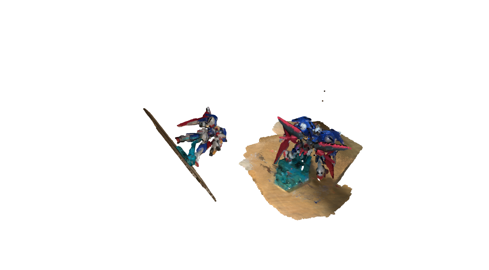
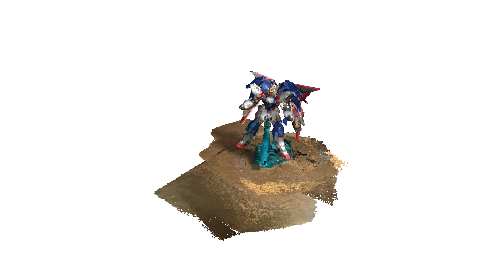
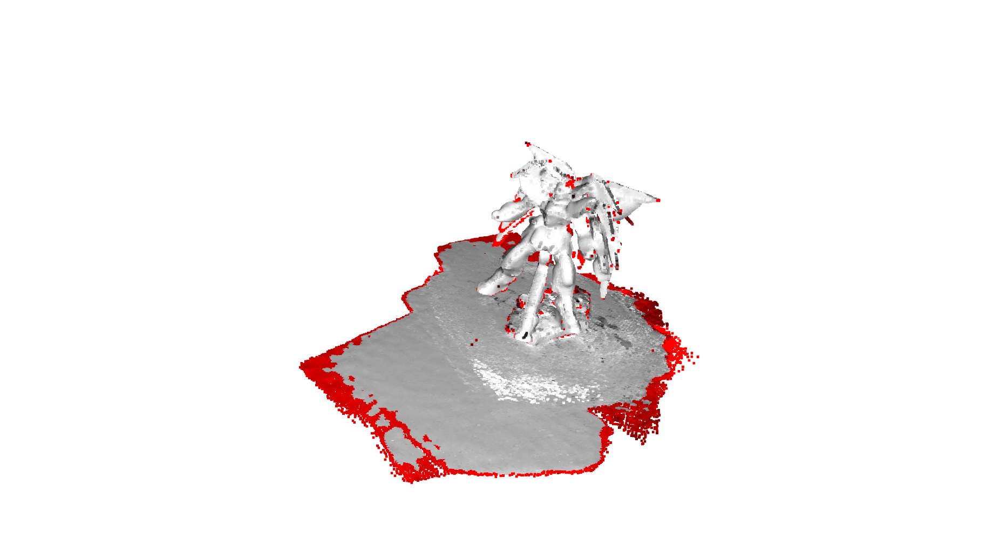
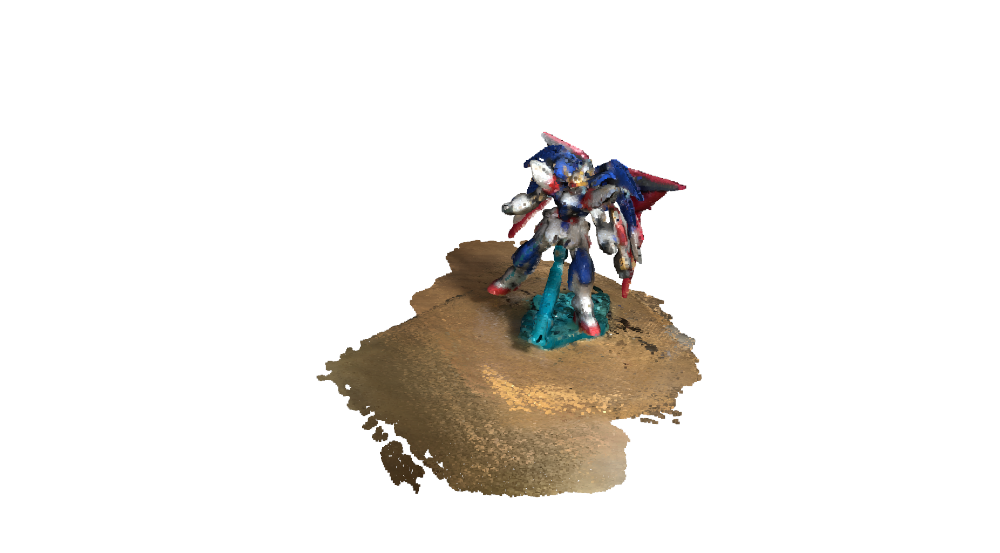
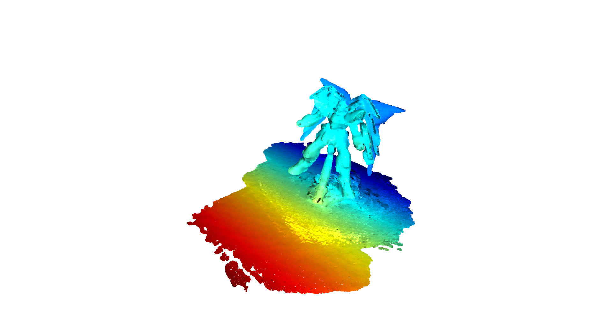
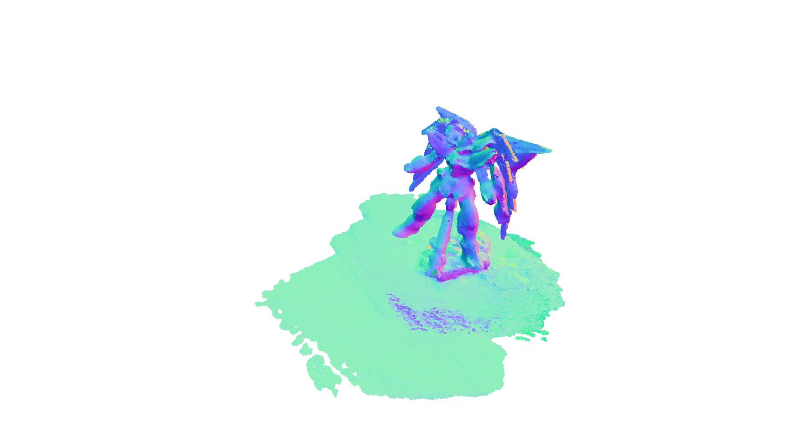

# simple_open3d_registration

Point Cloud registration and outlier rejection using open3d

# Install

```bash
pip3 install open3d
```

# Usage

```bash
python3 simple_registration.py ply/sample_gundum_01.ply ply/sample_gundum_02.ply
```

# Result

|01_before_registration|02_after_registration|
|:---|:---|
|||

|03_vis_outlier|04_after_outlier|
|:---|:---|
|||

|03_vis_outlier_Y|04_after_outlier_normal|
|:---|:---|
|||

